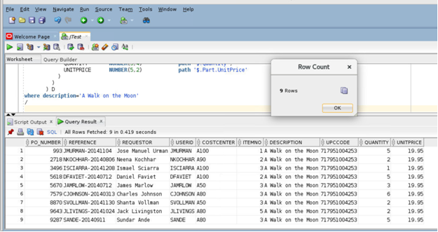

# Oracle JSON  

## Steps:

**Find the customers who all are purchased a specific products**

1. Find Row Count   

    ````
    <copy>
    select D.* from PURCHASE_ORDER p,
    JSON_TABLE(
    p.PO_DOCUMENT,
    '$' 
    columns(
           PO_NUMBER            NUMBER(10)                  path  '$.PONumber',
           REFERENCE            VARCHAR2(30 CHAR)           path  '$.Reference',
           REQUESTOR            VARCHAR2(32 CHAR)           path  '$.Requestor',
           USERID               VARCHAR2(10 CHAR)           path  '$.User',
           COSTCENTER           VARCHAR2(16)                path  '$.CostCenter',
           NESTED PATH '$.LineItems[*]'
    columns(
             ITEMNO         NUMBER(16)             path '$.ItemNumber', 
             DESCRIPTION    VARCHAR2(32 CHAR)      path '$.Part.Description', 
             UPCCODE        VARCHAR2(14 CHAR)      path '$.Part.UPCCode', 
             QUANTITY       NUMBER(5,4)            path '$.Quantity', 
             UNITPRICE      NUMBER(5,2)            path '$.Part.UnitPrice'
           )
         )
       ) D
    where PO_NUMBER = 1600  
    /

      </copy>
    ````
  
   

2. Find Row Count.
    
    ````
    <copy>
    select D.* from PURCHASE_ORDER p,
    JSON_TABLE(
    p.PO_DOCUMENT,
    '$' 
    columns(
           PO_NUMBER            NUMBER(10)                  path  '$.PONumber',
           REFERENCE            VARCHAR2(30 CHAR)           path  '$.Reference',
           REQUESTOR            VARCHAR2(32 CHAR)           path  '$.Requestor',
           USERID               VARCHAR2(10 CHAR)           path  '$.User',
           COSTCENTER           VARCHAR2(16)                path  '$.CostCenter',
           NESTED PATH '$.LineItems[*]'
    columns(
             ITEMNO         NUMBER(16)             path '$.ItemNumber', 
             DESCRIPTION    VARCHAR2(32 CHAR)      path '$.Part.Description', 
             UPCCODE        VARCHAR2(14 CHAR)      path '$.Part.UPCCode', 
             QUANTITY       NUMBER(5,4)            path '$.Quantity', 
             UNITPRICE      NUMBER(5,2)            path '$.Part.UnitPrice'
           )
         )
       ) D
    where description='A Walk on the Moon'
    /
     </copy>
    ````
    
   
    
**Notes:**The JSON_TABLE operator uses a set of JSON path expressions to map content from a JSON document into columns in the view. Once the contents of the JSON document have been exposed as columns, all of the power of SQL can be brought to bear on the content of JSON document.

See an issue?  Please open up a request [here](https://github.com/oracle/learning-library/issues).