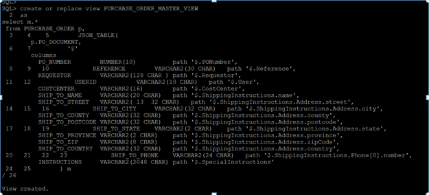

# Oracle JSON  


## Steps:

**How many orders were done by a customer with minimum 7 quantity and unit price minimum 25$ in  each   order (MV – sql queries)**

1. Note : With the simple SQL queries
 
   
   

    ````
    <copy>
    select PO_NUMBER, REFERENCE, INSTRUCTIONS, ITEMNO, UPCCODE, DESCRIPTION, QUANTITY, UNITPRICE
    from PURCHASE_ORDER_DETAIL_VIEW d
    where REQUESTOR = 'Steven King'
    and QUANTITY  > 7
    and UNITPRICE > 25.00
    /

      </copy>
    ````
  
   
    
**Notes:**  The above statements show how, once the relational views have been created, the full power of SQL can now be applied to JSON content, without requiring any knowledge of the structure of the JSON or how to manipulate JSON using SQL.

See an issue?  Please open up a request [here](https://github.com/oracle/learning-library/issues).