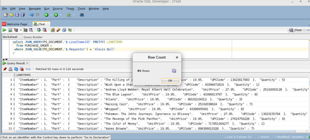
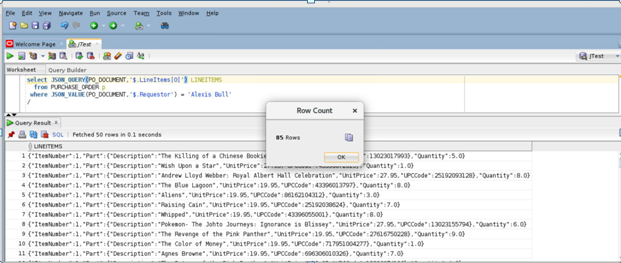
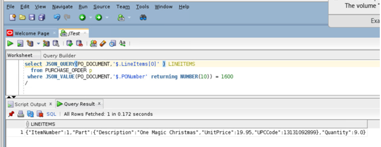

# Oracle JSON  


## Steps:

**Customer Purchase History Details (Json-Query&Json-value)**

1. Find Row Count   

    ````
    <copy>
    select JSON_QUERY(PO_DOCUMENT,'$.LineItems[0]' PRETTY) LINEITEMS
    from PURCHASE_ORDER p
    wherec(PO_DOCUMENT,'$.Requestor') = 'Alexis Bull'
    /

      </copy>
    ````
  
  
    
2. Without Pretty 

   ````
    <copy>
    select JSON_QUERY(PO_DOCUMENT,'$.LineItems[0]') LINEITEMS
    from PURCHASE_ORDER p
    where JSON_VALUE(PO_DOCUMENT,'$.Requestor') = 'Alexis Bull'
    /
    </copy>
    ````

  
  

  **Notes:** Json-value selects a scalar value from JSON data and returns it as a SQL value. You can also use json_value to create function-based B-tree indexes for use with JSON data — see Indexes for JSON Data. Function json-value has two required arguments and accepts optional returning and error clauses


See an issue?  Please open up a request [here](https://github.com/oracle/learning-library/issues).