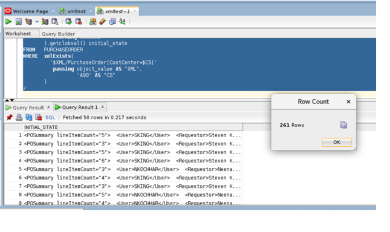

# Oracle XML  


## Steps:

1. Customer order summary – Cost center wise 
    
    XMLQUERY lets you query XML data in SQL statements. It takes an XQuery expression as a string literal, an optional context item, and other bind variables and returns the result of evaluating the XQuery expression using these input values. XQuery string is a complete XQuery expression, including prolog.

    ````
    <copy>
    SELECT xmlquery(
    '<POSummary lineItemCount="{count($XML/PurchaseOrder/LineItems/ItemNumber)}">{
    $XML/PurchaseOrder/User, $XML/PurchaseOrder/Requestor,
    $XML/PurchaseOrder/LineItems/LineItem[2]
    }
    </POSummary>' passingobject_value AS "XML"
    returning content 
    ).getclobval() initial_state
    FROM   PURCHASEORDER
    WHERE  xmlExists(
    '$XML/PurchaseOrder[CostCenter=$CS]'
    passingobject_value AS "XML",
    'A90' AS "CS"       )
    /


      </copy>
    ````
  
   
    
   

See an issue?  Please open up a request [here](https://github.com/oracle/learning-library/issues).